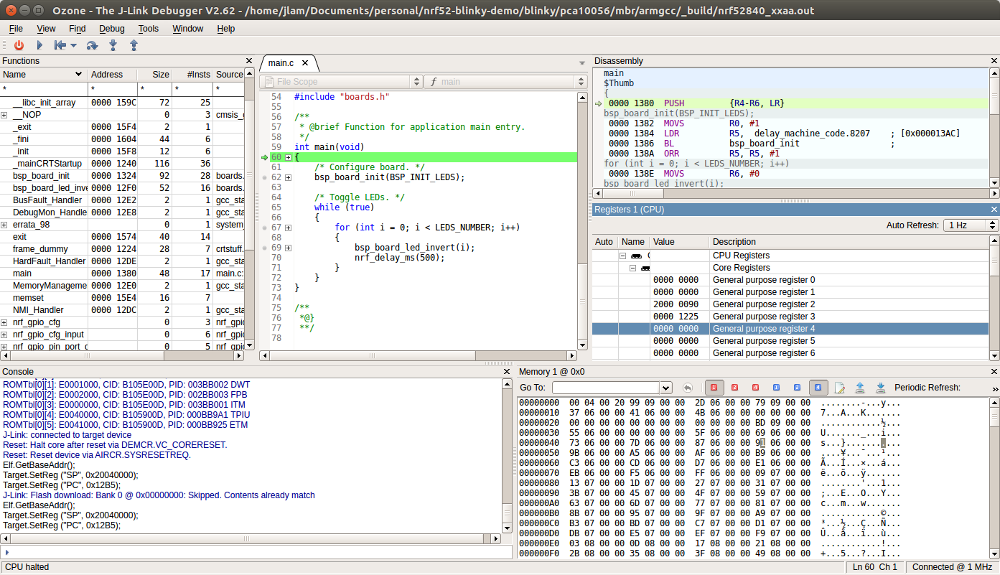

# nRF52 Blinky Demo

Example project setup, flash, and debug firmware using Visual Studio Code.

Toolchain is cross-platform, however the instructions below are specifically for Linux.


*Screencap of Visual Studio Code and Cortex-Debug extension.*

## Prerequisites

### Download Requirements

1. [nRF52 SDK](https://www.nordicsemi.com/Software-and-Tools/Software/nRF5-SDK)
2. [nRF52 Command Line Tools](https://www.nordicsemi.com/Software-and-Tools/Development-Tools/nRF5-Command-Line-Tools)
3. [Segger J-Link Software Tools](https://www.segger.com/downloads/jlink)
5. [GNU-RM Embedded Toolchain for ARM](https://developer.arm.com/tools-and-software/open-source-software/developer-tools/gnu-toolchain/gnu-rm/downloads)
  - It's recommended to install the GCC version that matches the Nordic SDK version. Check the GCC version in `<sdk>/components/toolchain/gcc/Makefile.posix` and download the appropriate version.
  - For nRF5 SDK 15.3.0, the gcc version is `gcc-arm-none-eabi-7-2018-q2-update`

Optional:

1. [Segger Ozone Debugger](https://www.segger.com/downloads/jlink/#Ozone)

### Setup Tools

Run the commands below to extract the archives to the respective paths.

- nRF5_SDK to `$HOME`
- nRF Command Line Tools to `/opt/` and `/usr/local/bin`
- gcc-arm-none-eabi to `/usr/local`

```bash
# Unpack SDK to home directory
unzip nRF5_SDK_15.3.0_59ac345.zip -d $HOME

# Unpack nRF command line tools and make accessible in terminal
sudo tar -xvf nRF-Command-Line-Tools_9_8_1_Linux-x86_64.tar --directory /opt/
sudo ln -s /opt/nrfjprog/nrfjprog /usr/local/bin/nrfjprog

# Install Segger
sudo apt install ./JLink_Linux_V644f_x86_64.deb

# Unpack gcc toolchain to /usr/local
sudo tar -xjvf gcc-arm-none-eabi-8-2018-q4-major-linux.tar.bz2 --directory /usr/local
```

If optional tools are downloaded:

```bash
 sudo apt install ./Ozone_Linux_V262_x86_64.deb
```

Check `nrfjproj --version` that it's been installed correctly.

### Setup SDK

In the nRF52 SDK folder, update the values in `components/toolchain/gcc/Makefile.posix`:

- `GNU_INSTALL_ROOT`
- `GNU_VERSION`

This is only required if using a different gcc version than specified. It's recommended to use the same one as the SDK.

## Using the Project

### Setup

In `blinky/` directory, do a global search and replace to update the SDK root to wherever your nRF5_SDK directory is:

- From: `SDK_ROOT := ../../../../../..`
- To: `SDK_ROOT := $(HOME)/nRF5_SDK_15.3.0_59ac345`

If required, add definition flags and/or update include paths in `.vscode/c_cpp_properties.json` (ie. add `FREERTOS` under `defines` if using FreeRTOS).

### Build and Flash

```bash
cd blinky/pca10056/mbr/armgcc

# To just build
make

# To build and flash
make flash
```

### Debugging

#### Visual Studio Code

In Visual Studio Code, install the Cortex-Debug extension.

Open the debug pane (`CTRL+SHIFT+D`) and select **Cortex-Debug**.

To create a new configuration, select **Add Configuration** and choose **Cortex-Debug**.

In `.vscode/launch.json`, update the `executable` and/or `armToolchainPath` if required.

Hit `F5` to start debugging.

#### Segger O-zone

Using Segger Ozone provides rich insights on memory, assembly instructions, peripheral registers, etc.



*Screencap of using Segger Ozone debugger.*

New project settings:

1. Select **Create new project**
2. Choose target device
  - Select device: `nRF52840_xxAA` (or other)
  - Peripherals: (blank)
3. Connection settings
  - Target interface: SWD
  - Target interface speed: 1 MHz
  - Host interface: USB
  - Serial no: (blank)
4. Program file
  - Select `pca10056/mbr/armgcc/_build/nrf52840_xxaa.out`
